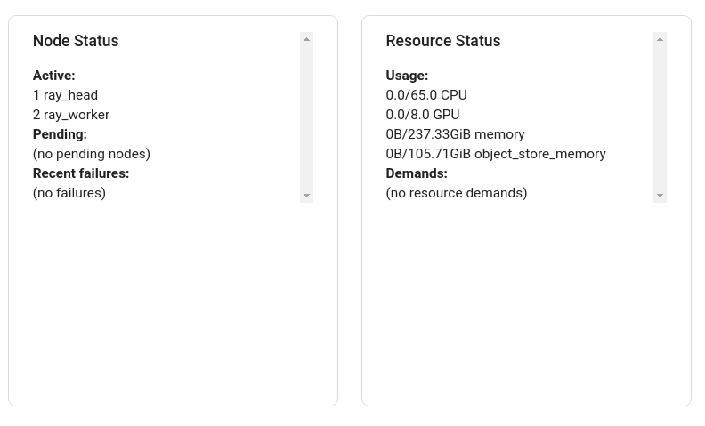
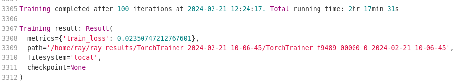
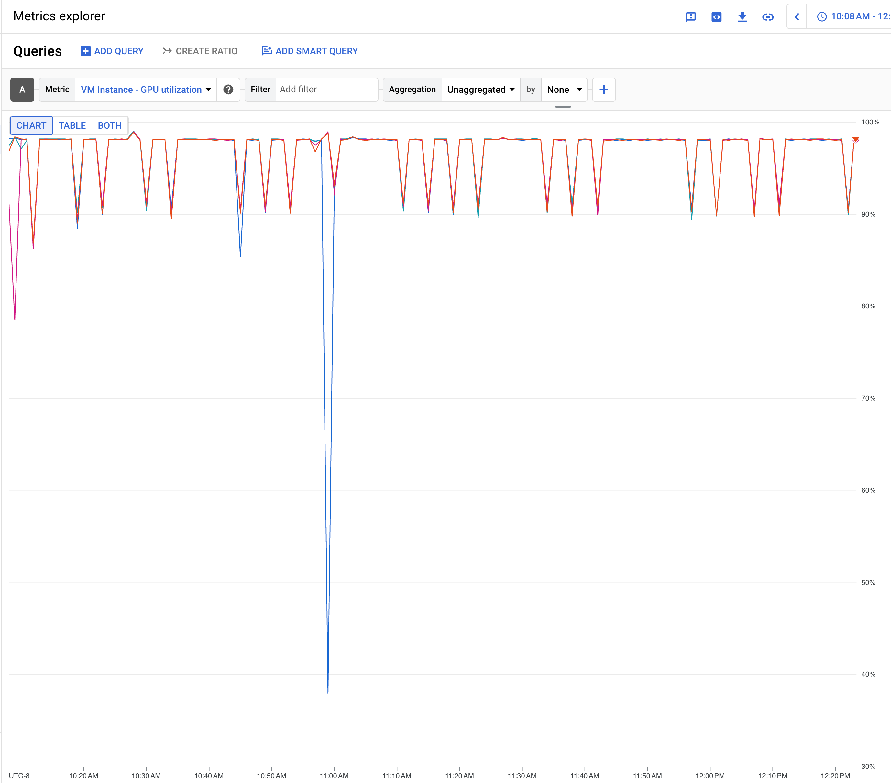

# Image Segmentation

## Problem
We will walk through a 3D medical image segmentation task and demonstrate how to adapt Dataflux Dataset into a real world training workload.

The walkthrough is based on an [open-source training workload](https://github.com/mlcommons/training/tree/master/image_segmentation/pytorch) with modifications that we’ll call out throughout this guide.

## Dataset

To demonstrate Dataflux Dataset’s performance optimization when the dataset consists of small files (e.g., 100 - 500KB), we made the following modifications to process the [original dataset](https://github.com/neheller/kits19):


*   We ran data preprocessing with a modified [TARGET\_SPACING](https://github.com/mlcommons/training/blob/master/image_segmentation/pytorch/preprocess_dataset.py#L19) of [48, 40, 40] instead of [1.6, 1.2, 1.2] and a modified [TARGET\_SHAPE](https://github.com/mlcommons/training/blob/master/image_segmentation/pytorch/preprocess_dataset.py#L20) of [32, 32, 32] instead of [128, 128, 128]. The goal is to create smaller processed images and labels while maintaining their authenticity.
*   After data preprocessing finishes, we placed the image .npy files and the labels .npy files into two different folders under the same GCS bucket.
*   The original dataset contains 300 samples. To demonstrate Dataflux’s scalability and performance, we replicated them to make a dataset of 100K samples.

The modified dataset is stored in this public [GCS bucket](https://console.cloud.google.com/storage/browser/dataflux-demo-public). Each image .npy file is around 128KB and each label .npy file is around 32KB. Note that even though the file sizes are equal, the contents are not.


## Model

We will use the same [U-Net3D](https://arxiv.org/pdf/1606.06650.pdf) model variant based on the [No New-Net](https://arxiv.org/pdf/1809.10483.pdf) paper.


## Deployment

### Dataset Preparation
First we will need to make a copy of the public [GCS bucket](https://console.cloud.google.com/storage/browser/dataflux-demo-public) into our own GCP project because we only have the "Read" access to the public bucket but we will need the "Write" access to perform Dataflux algorithms.

1. Create a Google Cloud Storage bucket with **Standard** storage class.
2. Copy the dataset using the following command:
   ```shell
   gcloud storage cp -r gs://dataflux-demo-public/dataset gs://{OUR_OWN_BUCKET}
   ```
   *Tip*: You can run this command in a GCP Cloud Shell.


### Cluster

We use [Ray.IO](Ray.IO) to deploy and scale the training workload with [PyTorch](https://pytorch.org/) as the underlying machine learning framework. 

We will spin up a [Ray cluster](https://docs.ray.io/en/latest/cluster/key-concepts.html#ray-cluster) for our workload. The [cluster.yaml](cluster.yaml) file contains the specification and here's the overview:


*   Ray head node
    *   There’s only one head node in the cluster that is responsible for cluster management. See more about the Ray head node [here](https://docs.ray.io/en/latest/cluster/key-concepts.html#head-node).
    *   Key Specification:
        *   **Machine type:** n1-standard-32
        *   **Source Image:** projects/deeplearning-platform-release/global/images/family/common-cpu
*   Ray worker node
    *   We have two worker nodes in the cluster and they are responsible for running the workload. See more about the Ray worker node [here](https://docs.ray.io/en/latest/cluster/key-concepts.html#worker-node).
    *   Key Specification:
        *   **Machine type**: n1-standard-32
        *   **Source Image**: projects/deeplearning-platform-release/global/images/family/common-cu121-debian-11-py310
            *   This image comes pre-installed with NVIDIA drivers and a lot more machine learning applications.
        *   **GPUs**: 4 \* NVIDIA Tesla V100 GPUs


> **_NOTE:_**  It would be best to run the following steps on your workstation with a display device so you can see the Ray dashboard using a browser.

1. Clone the `dataflux-pytorch` repository and go to the working directory.
   ```shell
   git clone --recurse-submodules https://github.com/GoogleCloudPlatform/dataflux-pytorch
   cd dataflux-pytorch
   pip install .
   cd demo/image-segmentation
   ```
2. [Install Ray](https://docs.ray.io/en/latest/ray-overview/installation.html).
   ```shell
   pip install -U "ray[default]" 
   ```
3. Modify the [cluster.yaml](cluster.yaml) file by replacing all the parameters highlighted in the curly brackets. Specifically, they are `{YOUR_CLUSTER_NAME}
`, `{YOUR_REGION}`, `{{YOUR_AVAILABILITY_ZONE}}` and `{YOUR_PROJECT_ID}`. Note that there's an additional `{YOUR_PROJECT_ID}` field in the `serviceAccounts` field that you'll need to replace.
1. Run the following command to start the Ray cluster. You may follow the logs to check the startup progress.
    ```shell
    ray up cluster.yaml -y --no-config-cache
    ```
2. Once the cluster has launched, run the following command to connect to the Ray dashboard.
   ```shell
   ray dashboard cluster.yaml --no-config-cache
   ```
3. On your workstation, you can visit http://localhost:8265/ to see the status of the created Ray cluster.

    * Note that it might take a while to set up the worker nodes. Once they are completed, you can verify the cluster status looks like:

    

### Workload

We based the workload scripts on the [open-source image segmentation training workload](https://github.com/mlcommons/training/tree/master/image_segmentation/pytorch) with a few modifications:
*   We removed training model validation for simplicity.
*   To make use of the Dataflux algorithms, we will write our own PyTorch Dataset to replace the existing one.

All the scripts are available in the same directory as this README and here are the major modifications explained:

1. In [`pytorch_loader.py`](pytorch_loader.py), we construct our own PyTorch Dataset that makes use of the Dataflux algorithms:

```python
class DatafluxPytTrain(Dataset):
    def __init__(
        self,
        project_name,
        bucket_name,
        config=dataflux_mapstyle_dataset.Config(),
        storage_client=None,
        **kwargs,
    ):
        # Data transformation setup.
        self.train_transforms = get_train_transforms()
        patch_size, oversampling = kwargs["patch_size"], kwargs["oversampling"]
        images_prefix, labels_prefix = kwargs["images_prefix"], kwargs["labels_prefix"]
        self.patch_size = patch_size
        self.rand_crop = RandBalancedCrop(
            patch_size=patch_size, oversampling=oversampling
        )

        # Dataflux-specific setup.
        self.project_name = project_name
        self.bucket_name = bucket_name
        self.config = config
        self.dataflux_download_optimization_params = (
            dataflux_core.download.DataFluxDownloadOptimizationParams(
                max_composite_object_size=self.config.max_composite_object_size
            )
        )
        if not storage_client:
            self.storage_client = storage.Client(
                project=project_name,
                client_info=ClientInfo(user_agent="dataflux/0.0"),
            )

        # Data listing.
        self.images = dataflux_core.fast_list.ListingController(
            max_parallelism=self.config.num_processes,
            project=self.project_name,
            bucket=self.bucket_name,
            sort_results=self.config.sort_listing_results,  # This needs to be True to map images with labels.
            prefix=images_prefix,
        ).run()
        self.labels = dataflux_core.fast_list.ListingController(
            max_parallelism=self.config.num_processes,
            project=self.project_name,
            bucket=self.bucket_name,
            sort_results=self.config.sort_listing_results,  # This needs to be True to map images with labels.
            prefix=labels_prefix,
        ).run()

    def __len__(self):
        return len(self.images)

    def __getitem__(self, idx):
        image = np.load(
            io.BytesIO(
                dataflux_core.download.download_single(
                    storage_client=self.storage_client,
                    bucket_name=self.bucket_name,
                    object_name=self.images[idx][0],
                )
            ),
        )

        label = np.load(
            io.BytesIO(
                dataflux_core.download.download_single(
                    storage_client=self.storage_client,
                    bucket_name=self.bucket_name,
                    object_name=self.labels[idx][0],
                )
            ),
        )

        data = {"image": image, "label": label}
        data = self.rand_crop(data)
        data = self.train_transforms(data)
        return data["image"], data["label"]

    def __getitems__(self, indices):
        images_in_bytes = dataflux_core.download.dataflux_download(
            project_name=self.project_name,
            bucket_name=self.bucket_name,
            objects=[self.images[idx] for idx in indices],
            storage_client=self.storage_client,
            dataflux_download_optimization_params=self.dataflux_download_optimization_params,
        )

        labels_in_bytes = dataflux_core.download.dataflux_download(
            project_name=self.project_name,
            bucket_name=self.bucket_name,
            objects=[self.labels[idx] for idx in indices],
            storage_client=self.storage_client,
            dataflux_download_optimization_params=self.dataflux_download_optimization_params,
        )

        res = []
        for i in range(len(images_in_bytes)):
            data = {
                "image": np.load(io.BytesIO(images_in_bytes[i])),
                "label": np.load(io.BytesIO(labels_in_bytes[i])),
            }
            data = self.rand_crop(data)
            data = self.train_transforms(data)
            res.append((data["image"], data["label"]))
        return res
```

2. Then we need to pass in the needed arguments to construct our new dataset. Therefore, in [`data_loader.py`](data_loader.py), we write

```python
train_data_kwargs = {
    "patch_size": flags.input_shape,
    "oversampling": flags.oversampling,
    "seed": flags.seed,
    "images_prefix": flags.images_prefix,
    "labels_prefix": flags.labels_prefix,
}
train_dataset = DatafluxPytTrain(
    project_name=flags.gcp_project,
    bucket_name=flags.gcs_bucket,
    config=dataflux_mapstyle_dataset.Config(sort_listing_results=True),
    **train_data_kwargs,
)
```

3. Finally, we support these additional flags in [`arguments.py`](arguments.py) and pass those values in from [`run_and_time.sh`](run_and_time.sh).

> **_IMPORTANT:_**  Make sure to modify the [`run_and_time.sh`](run_and_time.sh) file by specifying the values for `IMAGES_PREFIX`, `LABELS_PREFIX`, `GCP_PROJECT` and `GCS_BUCKET` based on the replicated project created in the earlier Dataset Preparation step.

4. Submit the workload job by running

```shell
export RAY_ADDRESS=http://localhost:8265
python3 submit.py
```

## Results
The job should finish within 3 hours and you can follow the job log by clicking into the job detail from the Ray dashboard. Here’s an example of a successful job:



Since we set up Ops Agent, we are able to view the GPU Utilization and other statistics from the "Metrics Explorer" in your GCP Project Console. Here's an example of the GPU Utilization:



We can observe excellent GPU performance with utilization average over 90% for the entire training run.